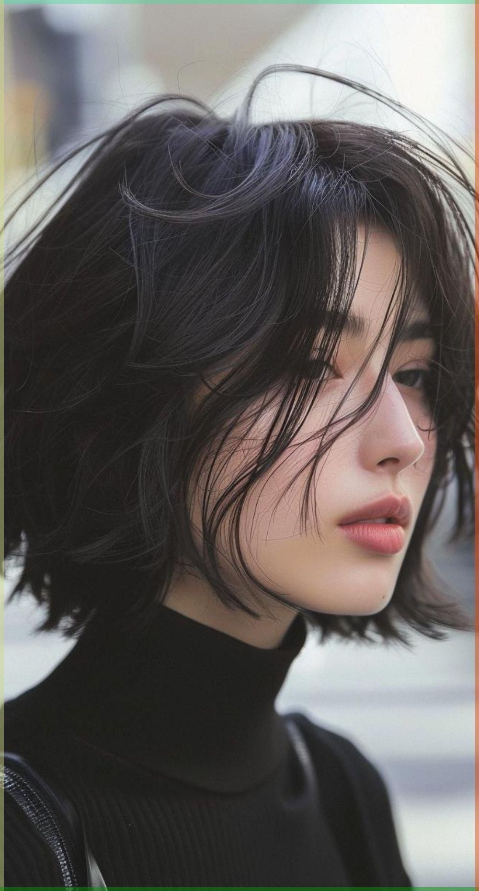

[Display]
Inspired by [Spu7Nix](https://www.youtube.com/watch?v=6aXx6RA1IK4&t=396s)

This is a recreation of the "algorithm" he used within this video the shapes i used were text with different fonts and colors
The process right now is slow and there will be a attempt at making a faster one using c++ and opengl

